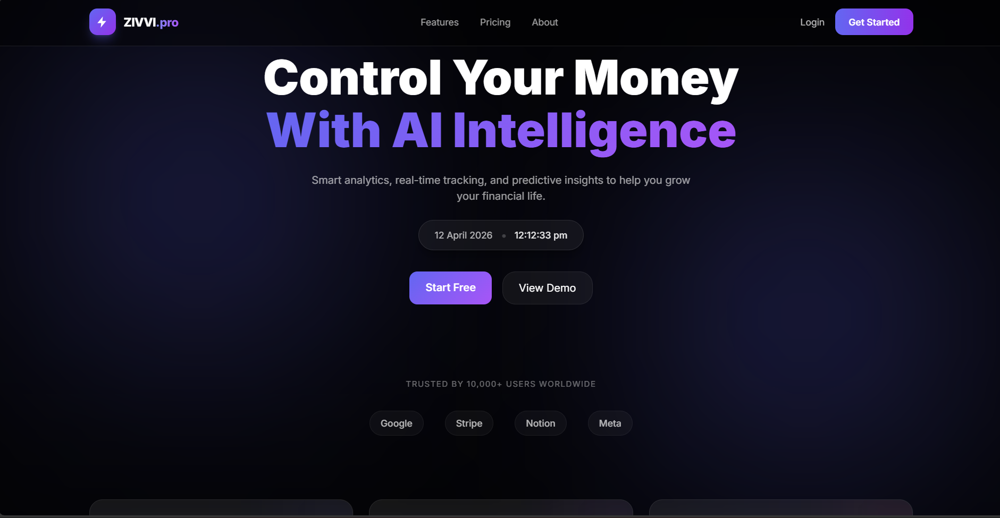
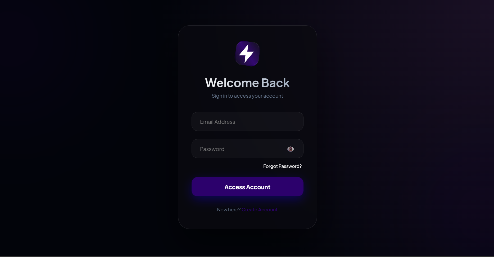
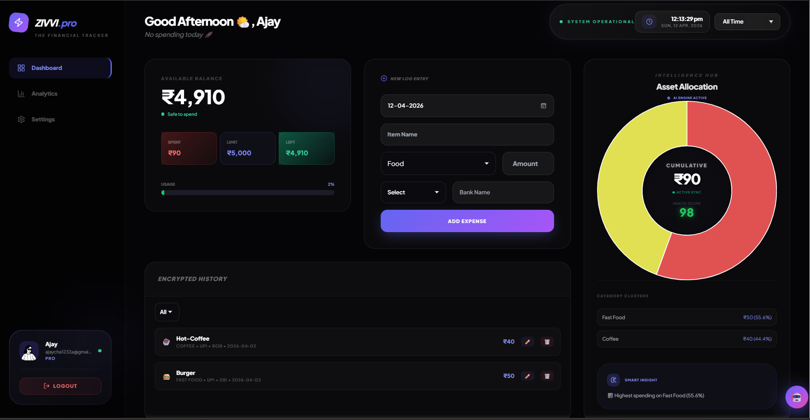
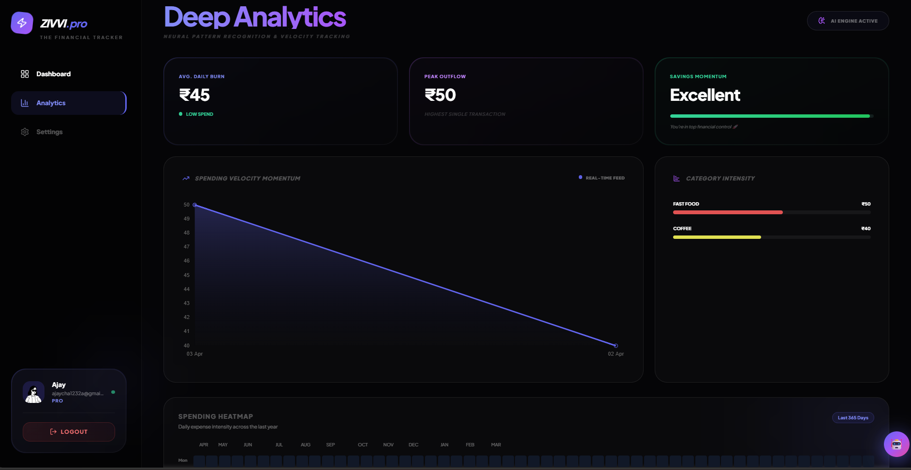
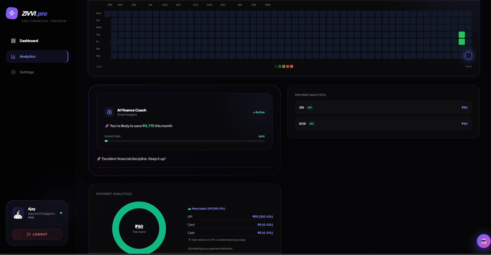
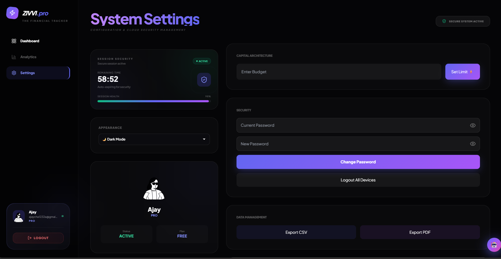
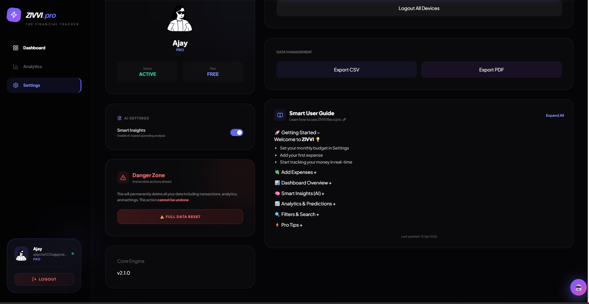

# 🚀 ZIVVI — AI Powered Finance Dashboard

<p align="center">
  <a href="https://zivvi-tracker.vercel.app">
    
  </a>
</p>

<p align="center">
  
  
  
  
</p>

<p align="center">
  <b>Your intelligent financial companion</b><br>
  Track • Analyze • Improve
</p>

## 🚧 Project Status

ZIVVI is an actively evolving project.  
We are continuously working on adding advanced features like AI improvements, chatbot enhancements, and real-world integrations to make it a complete financial assistant.

Stay tuned for upcoming updates 🚀

---

## ✨ Product Vision

ZIVVI is built to simplify financial management using **modern UI + intelligent insights**.

It goes beyond expense tracking —  
helping users **understand, control, and optimize their spending habits**.

---

## 📸 Project Preview

### 🏠 Landing Page
<p align="center">
  
</p>

---

### 🔐 Login Page
<p align="center">
  
</p>

---

### 📊 Dashboard Overview
<p align="center">
  
</p>

---

### 📈 Deep Analytics
<p align="center">
  
</p>

---

### 🧠 AI Insights & Heatmap
<p align="center">
  
</p>

---

### ⚙️ System Settings
<p align="center">
  
</p>

---

### 📘 Smart User Guide
<p align="center">
  
</p>

---

## 🧩 Project Structure

```
zivvi/
├── backend/              # Node.js + Express API
├── login/                # Authentication UI
├── zivvi_dashboard/      # Main dashboard UI
├── index.html            # Entry point
```

---

## 🎨 UI & Design

- ✨ Glassmorphism UI  
- 📱 Fully responsive  
- ⚡ Fast & lightweight  
- 🎯 User-focused design  

---

## ⚙️ Tech Stack

### 🔹 Frontend

* HTML5
* CSS3 (Glass UI + Responsive Design)
* JavaScript (Vanilla)
* Chart.js

### 🔹 Backend

* Node.js
* Express.js
* PostgreSQL
* JWT Authentication
* Nodemailer

### 🔹 Deployment

* Frontend → Vercel
* Backend → Render

---

## 🔐 Features

### 📊 Dashboard

* Real-time expense tracking
* Smart budget calculation
* Dynamic UI updates

### 📈 Analytics

* Spending trends visualization
* Category-wise breakdown
* Predictive insights

### 🧠 AI System

* Finance score calculation
* Smart recommendations
* Spending pattern analysis

### 🤖 AI Chatbot Assistant
- Built-in intelligent chatbot for managing daily expenses  
- Allows users to add expenses through simple conversational inputs  
- Automatically categorizes basic transactions  
- Improves user experience with quick and interactive financial assistance  

### 🔐 Security

* JWT-based authentication
* Session validation
* Protected routes

### 📩 Email System

* Weekly reports
* Smart insights
* Secure "Login to View" dashboard access

---

## 🚀 Getting Started

### 1️⃣ Clone Repository

```bash
git clone https://github.com/your-username/zivvi.git
cd zivvi
```

---

### 2️⃣ Backend Setup

```bash
cd backend
npm install
```

Create `.env` file:

```env
PORT=5000

DB_USER=postgres
DB_PASSWORD=your_password
DB_HOST=localhost
DB_PORT=5432
DB_NAME=authdb

JWT_SECRET=your_secret_key

EMAIL_USER=your_email
EMAIL_PASS=your_email_password (app password)

FRONTEND_URL=https://your-app.vercel.app
```

Run server:

```bash
node server.js
```

---

### 3️⃣ Frontend Setup

Open directly:

```
zivvi/index.html
```

OR deploy using Vercel.

---

## 🌐 Deployment

### 🔹 Frontend (Vercel)

* Import GitHub repo
* Root directory: `zivvi`
* Deploy

### 🔹 Backend (Render)

* Root directory: `zivvi/backend`
* Start command:

```bash
node server.js
```

* Add environment variables

---

## 🔗 API Configuration

```js
const BASE_URL = "https://your-backend.onrender.com"; // TODO: Replace with your production backend URL (Render)
```

---

## 📩 Email System

* Sends weekly financial reports
* Includes:

  * Spending summary
  * AI insights
  * Secure dashboard access button

---

## 🛡️ Security Notes

* Never expose `.env` file
* Use HTTPS in production
* Store JWT securely
* Validate all inputs

---

## 🔮 Future Roadmap
* 📱 Mobile App
* 🔗 Bank Integration
* 🧠 Advanced AI Engine
* 📊 Deep Analytics
* 🔐 OAuth Login

---

## 🤝 Contributing

1. Fork the repository
2. Create a new branch
3. Commit your changes
4. Open a Pull Request

---

## 📄 License

MIT License © 2026

---

## 💡 Author

**Ajay Chauhan**
BCA – Data Science & Artificial Intelligence (2nd Year)
Babu Banarasi Das University (BBDU), Lucknow

---

## ⭐ Support

If you like this project:

⭐ Star the repo
🚀 Share with others

---

## 🔥 Final Note

ZIVVI is not just an expense tracker —
it's your **AI-powered financial assistant**.

---
